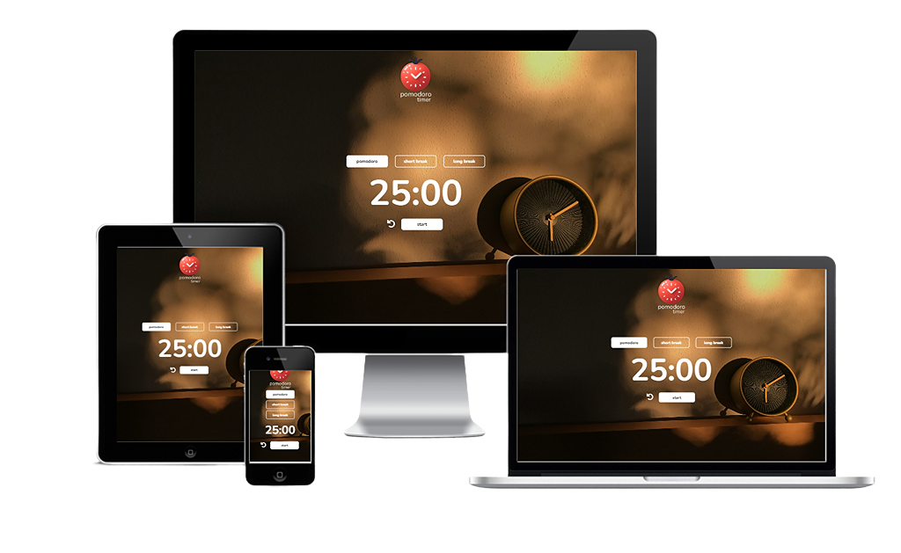

<div align="center">

</div>

<div align="center">

# DCI PB Final Project

</div>

<div align="center">
  
[**Screenshots**](#screenshots) || [**Features**](#features) || [**Technologies**](#technologies) || [**Color Reference**](#color-reference) || [**Installation**](#installation) || [**Demo**](#demo) || [**Feedback**](#feedback)

</div>

This repository was created for a project at the Digital Career Institute (DCI). It contains all the code for a Pomodoro Timer application, written in JavaScript.

The project is the result of a few days of work and demonstrates the skills I acquired during my time at DCI when dealing with JavaScript, HTML and CSS.

The application has a simple and intuitive design that looks good on all devices. It allows users to switch between different timer durations and to start, pause, and reset the timer.

## Screenshots




## Features

- **Pomodoro Timer**: The main feature of this application is the Pomodoro timer. Users can start a 25-minute timer to focus on their work, and then take a short break.

- **Start, Pause, and Reset**: Users have full control over the timer. They can start, pause, and reset the timer at any time.

- **Responsive Design**: The application has a responsive design that looks good on all devices, from mobile phones to desktop computers.

- **Intuitive User Interface**: The user interface is simple and intuitive, making the application easy to use.

## Technologies

- Tailwind CSS
- JavaScript
- HTML

## Color Reference

| Color       | Hex                                                              |
| ---------- | ---------------------------------------------------------------- |
| Young Mahogany |  #c93835 |
| White |  #ffffff |
| Black |  #000000 |
| Black Rock |  #2d2f3b |

## Installation

Follow these steps to get the project up and running on your local machine:

1. **Clone the Repository**: First, clone the repository to your local machine. You can do this by running the following command in your terminal:

```bash
git clone git@github.com:mkamburdev/PB-Final-Project.git
```
2. **Navigate to the Project Directory**: Change your current directory to the project directory:

```bash
cd PB-Final-Project
```

3. **Open the Project**: You can now open the project in your preferred code editor. If you're using Visual Studio Code, you can open the project by typing:

```bash
code .
```

4. **Run the Project**: Since this is a front-end project, you can run it in your browser. If you're using a live server extension in your code editor, start the live server. Otherwise, you can simply open the index.html file in your browser.
  
## Demo

[https://pb-final-project.vercel.app](https://pb-final-project.vercel.app)

  
## Feedback

If you have any feedback, please contact us at mkambur@proton.me.
